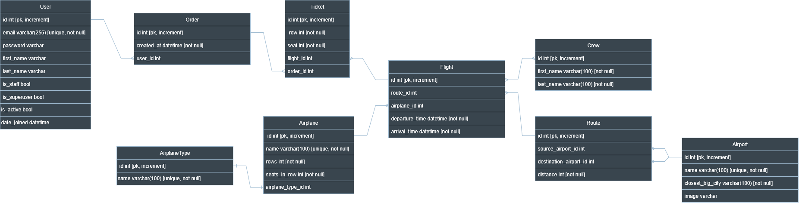

# ✈️ Sky Route API

Sky Route API is a Django REST Framework (DRF) project for managing **airports, routes, flights, airplanes, crews, orders, and tickets**.
It also supports **JWT authentication** and provides **interactive API documentation** (Swagger & Redoc).

---
## Database structure

System was developed by following db structure



---
## 📦 Features
- 🔑 User registration & authentication (JWT)
- 🛫 Airport management
- 🛣️ Route management
- ✈️ Airplane management
- 👨‍✈️ Crew management
- 📅 Flight scheduling & filtering
- 🎟 Orders & tickets system
- 🔐 Admin-only access for write operations
- 📖 Interactive API docs (Swagger / Redoc)

---

## ⚙️ Installation

### 1. Clone the repository
```bash
  git clone [https://github.com/your-username/sky-route-api.git](https://github.com/your-username/sky-route-api.git)
  cd sky-route-api
````

### 2\. Create and activate virtual environment

```bash
  python -m venv venv
  source venv/bin/activate   # On Windows: venv\Scripts\activate
```

### 3\. Install dependencies

```bash
  pip install -r requirements.txt
```

### 4\. Run migrations

```bash
  python manage.py migrate
```

### 5\. Create a superuser

```bash
  python manage.py createsuperuser
```

### 6\. Run the development server

```bash
  python manage.py runserver
```

-----

## 🐳 Docker Setup

Run with Docker Compose:

```bash
  docker-compose up --build
```

-----

## 📚 API Documentation

  - **Swagger UI** → `http://localhost:8000/api/doc/swagger/`
  - **Redoc** → `http://localhost:8000/api/doc/redoc/`
  - **Schema (OpenAPI JSON)** → `http://localhost:8000/api/schema/`

-----

## 🔑 Authentication

Authentication is handled with JWT tokens (`djangorestframework-simplejwt`).

| Method | Endpoint | Description | Auth |
|---|---|---|---|
| `POST` | `/api/accounts/token/` | Obtain tokens | ❌ |
| `POST` | `/api/accounts/token/refresh/` | Refresh token | ❌ |
| `POST` | `/api/accounts/token/verify/` | Verify token | ❌ |

-----

## 📖 API Endpoints

### 👤 Accounts (`/api/accounts/`)

| Method | Endpoint | Description | Auth |
|---|---|---|---|
| `POST` | `/register/` | Register a new user | ❌ |
| `POST` | `/token/` | Obtain JWT tokens | ❌ |
| `POST` | `/token/refresh/` | Refresh access token | ❌ |
| `POST` | `/token/verify/` | Verify token | ❌ |
| `GET` | `/me/` | Get current user info | ✅ |

### 🛫 Airports (`/api/sky-route/airports/`)

| Method | Endpoint | Description | Auth |
|---|---|---|---|
| `GET` | `/` | List all airports | ❌ |
| `POST` | `/` | Create new airport | ✅ (admin) |
| `GET` | `/{id}/` | Retrieve airport details | ❌ |

### 🛣️ Routes (`/api/sky-route/routes/`)

| Method | Endpoint | Description | Auth |
|---|---|---|---|
| `GET` | `/` | List all routes | ❌ |
| `POST` | `/` | Create new route | ✅ (admin) |
| `GET` | `/{id}/` | Route details | ❌ |

### ✈️ Airplanes (`/api/sky-route/airplanes/`)

| Method | Endpoint | Description | Auth |
|---|---|---|---|
| `GET` | `/` | List all airplanes | ❌ |
| `POST` | `/` | Create new airplane | ✅ (admin) |
| `GET` | `/{id}/` | Airplane details | ❌ |

### 👨‍✈️ Crew (`/api/sky-route/crew/`)

| Method | Endpoint | Description | Auth |
|---|---|---|---|
| `GET` | `/` | List crew members | ❌ |
| `POST` | `/` | Add crew member | ✅ (admin) |
| `GET` | `/{id}/` | Crew member details | ❌ |

### 📅 Flights (`/api/sky-route/flights/`)

| Method | Endpoint | Description | Auth |
|---|---|---|---|
| `GET` | `/` | List all flights | ❌ |
| `GET` | `/{id}/` | Flight details | ❌ |
| `GET` | `/?source=Kyiv&destination=Lviv&arrival_before=2025-09-17T12:00` | Filter flights by parameters | ❌ |
| `POST` | `/` | Create new flight | ✅ (admin) |

### 🎟 Orders & Tickets (`/api/sky-route/`)

| Method | Endpoint | Description | Auth |
|---|---|---|---|
| `GET` | `/orders/` | List my orders | ✅ |
| `POST` | `/orders/` | Create new order | ✅ |
| `GET` | `/tickets/` | List my tickets | ✅ |

-----

## 🔐 Auth Legend

  - **❌** – Public (no auth required)
  - **✅** – Requires JWT token
  - **✅ (admin)** – Admin-only

-----

## 🛠 Example: Register & Book Ticket

### 1\. Register new user

```bash
  POST /api/accounts/register/
```

**Body:**

```json
{
  "email": "user@example.com",
  "password": "strongpassword"
}
```

### 2\. Obtain JWT token

```bash
  POST /api/accounts/token/
```

**Body:**

```json
{
  "email": "user@example.com",
  "password": "strongpassword"
}
```

### 3\. Book a flight ticket

```bash
  POST /api/sky-route/orders/
```

**Header:**

```
Authorization: Bearer <access_token>
```

**Body:**

```json
{
  "tickets": [
    {"row": 5, "seat": 2, "flight": 1}
  ]
}
```

-----

## 🖥 Admin Panel

Django admin is available at: `http://localhost:8000/admin/`

-----

## 👤 Author

  * [Oleksanr Turulko](https://www.linkedin.com/in/turulko-oleksandr-2a5692246/)
